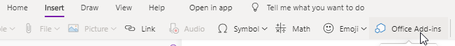
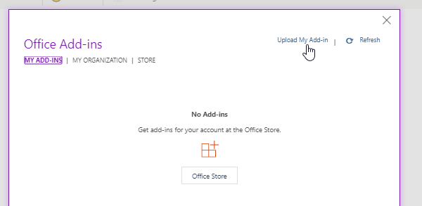
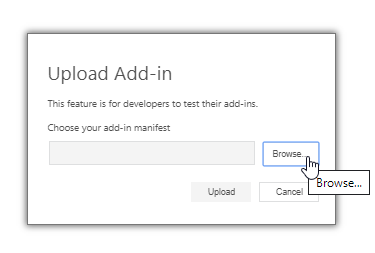
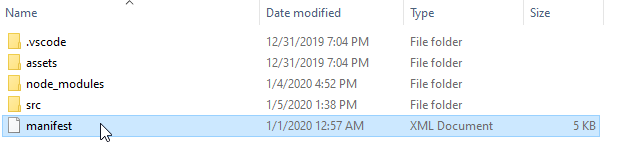
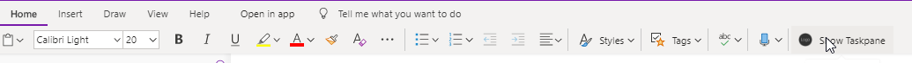
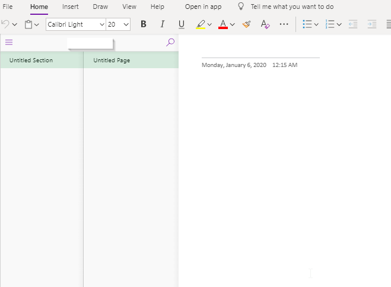
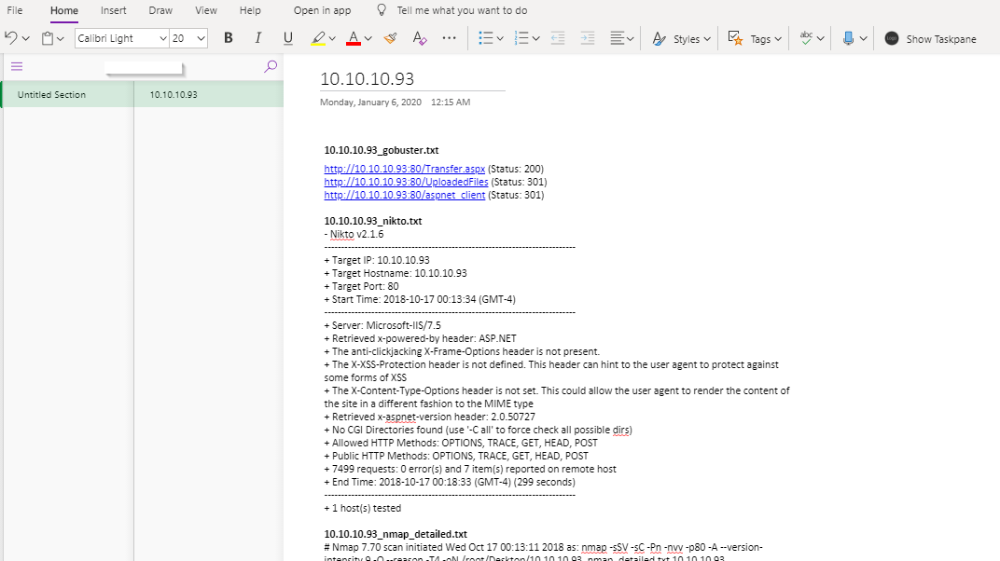

# A simple Add-in for OneNote

Program created by eRaMvn. 

The purpose of this Add-in is to put of the text file (File with the txt extension) to OneNote programmatically. As only OneNote for Business supports the use of API for free. I created this Add-in to automate this process. This Add-in also uses OneNote API, but it interacts with the web version of OneNote (https://www.onenote.com/notebooks) instead of the offline one. This Add-in is only a workaround that is still in development to help pentesters store all of the notes in one place. It works well with my other tool GoldFish at (https://github.com/eRaMvn/LazyTools)

#**Prequisites**:
```
nodejs
nodemon package (npm i nodemon)
cors package (npm i cors)
```

I followed this guideline from Microsoft (https://docs.microsoft.com/en-us/office/dev/add-ins/quickstarts/onenote-quickstart) to test my api.

Basically what this tool does is:
1. Obtain the contents of all of the text files under web-server/current-pentest 
2. Spin up the webpack for OneNote Add-in to interact with localhost
3. Spin up a small web server to serve the contents of the text file
4. Serve the content when the Run button of the OneNote Add-in


## Step to set up:

1. Go to each folder **My Office Add-in** and **web-server** folders and run
```
npm install
```
2. Have two terminals open. In one terminal, run web-pack, under **My Office Add-in**
```
npm run start:web
```
This server will listen on port 3000

In a second terminal, under **web-server/src**
```
nodemon app.js
```
The express server will listen on port 5000
The two servers are now ready!

## OneNote
* Go to OneNote online at (https://www.onenote.com/notebooks) and log in to one of your account
* Go to **Insert > Office Add-ins** to add the add-in



* Upload the manifest under **My Office Add-in** by







* Add the text files you want to put to **current_pentest** under **web-server** folder. I already put some sample files there for testing
* Create a new page in the section that you want to put it in
* Go back to **Home > Show Taskpane**. You should see a sidebar as follow. If for some reasons you don't see it, please reload your OneNote page



**Before running**



**After running**



## Step to tear down:
1. Stop the express server by pressing Ctrl+C
2. Stop the webpack by typing
```
npm stop
```